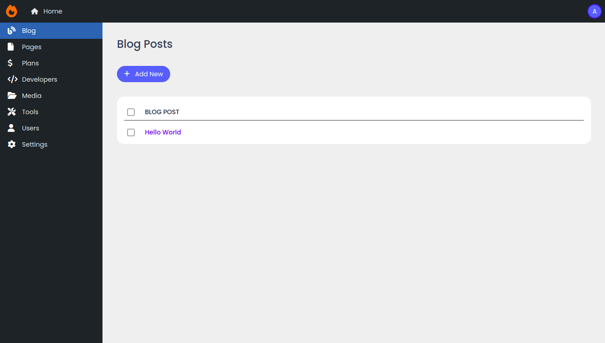

# Django Admin Plus

Django admin plus helps you to create beautiful admin interface quickly in minimal steps.



## Installation

```bash
pip install -i https://test.pypi.org/simple/ dj-admin-plus==0.0.6
```

## Update your settings file

Add DJ Admin plus in your installed apps.

```python
INSTALLED_APPS = [
    'django.contrib.admin',
    'django.contrib.auth',
    'django.contrib.contenttypes',
    'django.contrib.sessions',
    'django.contrib.messages',
    'django.contrib.staticfiles',

    'dj_admin_plus',  # Add DJ Admin plus
]
```

## Configure urls

Add new admin interface to the urls.py file.

```python
from django.conf import settings
from django.conf.urls.static import static
from django.contrib import admin
from django.urls import path, include

urlpatterns = [
    path('admin/', include('dj_admin_plus.urls')),  # Add DJ Admin plus
    path('classic/', admin.site.urls),  # Old admin interface still works
]

urlpatterns += static(settings.MEDIA_URL, document_root=settings.MEDIA_ROOT)

```

## Register navigation

You need to register your navigation according to your need either in models.py or views.py in one
of the installed apps.

For example, update your `models.py`.

```python
from django.contrib.auth import get_user_model

from dj_admin_plus import navigation
from dj_admin_plus.navigation import Navigation

from test_app.models import Blog, Category

navigation.register([
    Navigation(
        _id='dashboard',
        title='Dashboard',
        icon_class='fa-gauge-high',
        url='/dashboard/'
    ),

    Navigation(
        _id='blog',
        title='Blog',
        icon_class='fa-file',
        model=Blog,
        children=[
            Navigation(_id='all_posts', title='All Posts', model=Blog),
            Navigation(_id='categories', title='Categories', model=Category)
        ]
    ),

    Navigation(_id='users', title='Users', icon_class='fa-user', model=get_user_model()),

    Navigation(_id='settings', title='Settings', icon_class='fa-gear')
])
```

For sidebar icons, DJ Admin plus uses [free font awesome solid icons](https://fontawesome.com/search?o=r&m=free).

## Configure default navigation page

You need to choose the default page when [http://127.0.0.1:8000](http://127.0.0.1:8000) is visited.
It is because DJ Admin plus don't know which page to show first until you specify.

There are two ways to set up default page in DJ Admin plus.

### Option 1: Set first navigation as a default page

You need to pass extra argument `select_fallback_first=True`.

```python
from dj_admin_plus import navigation

navigation.register([...], select_fallback_first=True)
```

In this method, when you access the admin page, it will redirect to the first navigation item you specified in register
method.

### Option2: Using Django view

The above method may be unsuitable for you when you want to display a navigation like dashboard when the admin page is
accessed.

It is because the above method adds the additional path which makes the url like
[http://127.0.0.1:8001/admin/dashboard/](http://127.0.0.1:8000/admin/dashboard/) instead.

#### Create a new view

Here is a minimal example.

Create a new `dashboard.html` for dashboard view.

```html





<p>Your custom code</p>

```

In your views `views.py` file:

```python
from django.shortcuts import render


def dashboard_view(request):
    return render(request, 'dashboard.html')
```

Update your previous navigation register to:

```python
from dj_admin_plus import navigation
from dj_admin_plus.navigation import Navigation

from test_app.views import dashboard_view

navigation.register([
    Navigation(
        _id='dashboard',
        title='Dashboard',
        icon_class='fa-gauge-high',
        view=dashboard_view  # Change to view instead
    ),
    ...
])
```
